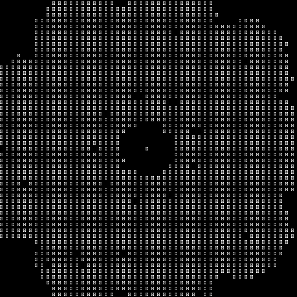

# Mandaloid Cybersigil

Mandaloid Cybersigil is not Cybersigilism.



Generate symmetric ASCII sigils from text using deterministic fractal geometry. Outputs static sigils, terminal animations, or square-pixel GIFs suitable for affirmative meditation, art, or cryptographic ornamentation.

## Usage

```bash
# Basic sigil
python mandeloid_sigil.py "your phrase"

# Animated terminal sequence
python mandeloid_sigil.py --animate-hash "your phrase"

# Save as symmetric GIF (requires Pillow)
python mandeloid_sigil.py --gif sigil.gif --size 25 "your phrase"
```

The `--size` parameter controls canvas dimensions (odd numbers recommended). GIF output renders each character cell as a square pixel to preserve geometric symmetry.
